<div align="center">


<br/>


<br/>

<p align="center">
  <a href="mailto:bt.youssef.369@gmail.com">
    
  </a>
  <a href="https://www.linkedin.com/in/youssef-bouzit-74863239b/">
    
  </a>
  <a href="https://www.kaggle.com/yussefbt">
    
  </a>
  <a href="https://huggingface.co/YoussefBT">
    
  </a>
  <a href="https://github.com/YOUSSEF-BT">
    
  </a>
  <a href="https://youssef-bt.github.io/">
    
  </a>
</p>


</div>

---

##  Who I Am

```python
class YoussefBouzit:
    name = "Youssef Bouzit"
    role = "Data Science Engineer"
    location = "Rabat, Morocco"
    current_status = "Open to full-time CDI opportunities"

    education = (
        "State Engineering Degree in Data Science "
        "from SUP MTI Rabat"
    )

    experience = (
        "Completed a 6-month AI & Computer Vision engineering internship "
        "at ABA Technology / NEXTRONIC"
    )

    interests = [
        "Data Science",
        "Artificial Intelligence",
        "Machine Learning",
        "Deep Learning",
        "Computer Vision",
        "NLP",
        "RAG and LLM Systems",
        "Data Analytics",
        "MLOps",
        "Data Engineering"
    ]

    open_to = [
        "Data Scientist roles",
        "AI/ML Engineer roles",
        "Computer Vision Engineer roles",
        "RAG/LLM Engineer roles",
        "MLOps Engineer roles"
    ]

    mindset = "Building practical, reliable, and explainable AI systems."
```

<div align="center">

### I build practical Data and AI systems

### that can be tested, explained, measured, and improved.

</div>

---

##  Professional Direction

<table>
  <tr>
    <td width="33%" align="center">
      <h3>📊 Data Analytics</h3>
      <p>Cleaning data, extracting insights, building dashboards, and translating numbers into decisions.</p>
    </td>
    <td width="33%" align="center">
      <h3>🤖 Machine Learning</h3>
      <p>Building predictive models, evaluating performance, and improving data-driven workflows.</p>
    </td>
    <td width="33%" align="center">
      <h3>🧠 AI Applications</h3>
      <p>Using AI, Computer Vision, NLP, and RAG systems to create solutions that solve real problems.</p>
    </td>
  </tr>
</table>

<div align="center">

I am open to **full-time CDI opportunities** as a **Data Scientist**, **AI/ML Engineer**, **Computer Vision Engineer**, **RAG/LLM Engineer**, or **MLOps Engineer**.

</div>

---

##  Tech Stack

<div align="center">

### Languages & Data


<br/><br/>


---

### AI, Machine Learning & Analytics


<br/><br/>


---

### Databases, BI & Tools


<br/><br/>


---

### Web & Application Development


</div>

---

##  How I Think

<table>
  <tr>
    <td width="50%">
      <h3>Analytical</h3>
      <p>I like breaking problems down, understanding the data, and finding the signal behind the noise.</p>
    </td>
    <td width="50%">
      <h3>Practical</h3>
      <p>I care about building systems that can be used, tested, explained, and improved.</p>
    </td>
  </tr>
  <tr>
    <td width="50%">
      <h3>Curious</h3>
      <p>I am interested in AI, Computer Vision, NLP, RAG systems, model behavior, and robustness.</p>
    </td>
    <td width="50%">
      <h3>Growth-Oriented</h3>
      <p>I continuously improve my technical skills, engineering practices, communication, and project quality.</p>
    </td>
  </tr>
</table>

---

##  Current Focus

```yaml
currently:
  - Seeking a full-time CDI opportunity
  - Maintaining and improving OpenLegaMa
  - Building reliable AI, RAG, and Computer Vision systems
  - Strengthening MLOps, evaluation, and deployment practices

open_to:
  - Data Scientist roles
  - AI/ML Engineer roles
  - Computer Vision Engineer roles
  - RAG/LLM Engineer roles
  - MLOps Engineer roles
  - Collaboration opportunities
```

---

##  GitHub Activity

<div align="center">





<br/><br/>


</div>

---

##  Let’s Connect

<div align="center">

I am open to **full-time CDI opportunities**, technical collaborations, and meaningful Data and AI projects.

<br/><br/>

<a href="mailto:bt.youssef.369@gmail.com">
  
</a>

<a href="https://www.linkedin.com/in/youssef-bouzit-74863239b/">
  
</a>

<a href="https://huggingface.co/YoussefBT">
  
</a>

<a href="https://github.com/YOUSSEF-BT">
  
</a>

<br/><br/>

### “Building practical, reliable, and explainable Data and AI systems.”

</div>


